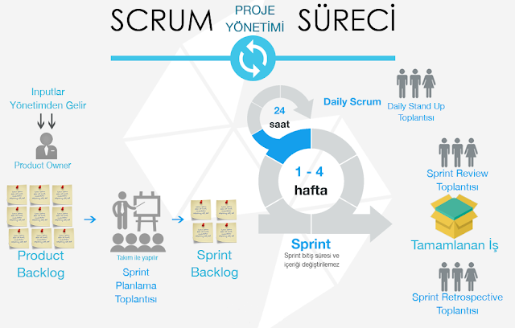

# Scrum Metodolojisi

## Scrum'ın Ayakları

- Şeffaflık
- Gözlem
- Adaptasyon

## Scrum Değerleri

1. Taahhüt
2. Odaklanma
3. Açıklık
4. Saygı
5. Cesaret

---

## Scrum Döngüsü (Scrum Cycle)

### 1. Müşteri

- Inputlar müşterilerden gelir.

⬇

### 2. Product Owner (Ürün Sahibi)

- Müşteri ihtiyaçlarını analiz eder.
- Ürün gereksinimlerini belirler.

⬇

### 3. Product Backlog (Ürün İş Listesi)

- Yapılacak tüm işler burada tutulur.
- Özellikler, hatalar ve geliştirmeler backlog içinde yer alır.

⬇

### 4. Sprint Planning Meeting (Sprint Planlama Toplantısı)

Katılımcılar:

- Scrum Master
- Development Team (Geliştirme Takımı)
- Product Owner

Amaç:

- Sprint içinde yapılacak işleri seçmek.
- Sprint hedefini belirlemek.

⬇

### 5. Sprint Backlog (Sprint İş Listesi)

- Sprint boyunca yapılacak görevlerin listesi oluşturulur.

⬇

## Sprint Süreci (3-4 Hafta)

Sprint süresince:

### Daily Scrum (Günlük Scrum)

- Her 24 saatte bir yapılır.
- Kısa durum toplantısıdır.

Sorular:

1. Dün ne yaptım?
2. Bugün ne yapacağım?
3. Önümde engel var mı?

⬇

### Product Increment (Ürün Parçası)

- Sprint sonunda çalışan ürün çıktısı oluşur.

⬇

### Sprint Review Meeting (Ürün Değerlendirme Toplantısı)

Katılımcılar:

- Product Owner
- Scrum Master
- Paydaşlar
- Development Team

Amaç:

- Çıkan ürünü değerlendirmek.
- Geri bildirim almak.

⬇

### Sprint Retrospective Meeting (Süreç Değerlendirme Toplantısı)

Katılımcılar:

- Scrum Master
- Development Team
- Product Owner

Amaç:

- Süreci değerlendirmek.
- İyileştirme alanlarını belirlemek.

⬇

### En Az 1 Gelişim Alanı

- Bir sonraki sprint için iyileştirme hedefi belirlenir.

-- Döngü tekrar başlar.
